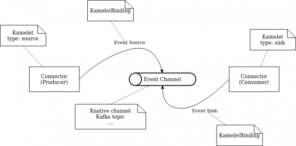

# Lab 2 - Customizing Kamelets

## Intro

Red Hat ships many kamelets with the camel-k operator out of the box:
```
$  oc project userX-dev
$  oc get kamelet | wc -l
      202
```

`Kamelets` are __not as flexible__ as the camel components which they are based on. If the underlying camel component supports hundreds of parameters, the corresponding kamelet only expose a couple, chances are, the out of the box kamelet will not be directly useful at your customer or for your use case.

People often don't realize that `kamelet` can, and even should be, __extended and customized__. This is how you can ge the best experience out of using them - by tailoring them precisely for your particular use case. And __this is what we are going to do in the Lab 2.__

`Kamelets` can be `Sources` or `Sinks` and are connected throught `KameletBindings`

<br/>



<br/>

## Task

Most times the integration with any Artemis broker needs __authenticated users and one-way ssl enforced__.  - __The out of the box kamelet doesn't support neither authentication nor ssl__

<br/>

__1. Support basic authentication against Artemis broker__

 - Inspect the out of the box kamelet to understand its internal mechanics:
   ```
   $ oc project userN-dev

   $ cd basic-auth

   $ oc get kamelet jms-amqp-10-sink -o yaml | oc neat > custom-sink-kamelet.yaml
   ```
 - Inspect the [ConnectionFactory constructor](https://github.com/apache/qpid-jms/blob/main/qpid-jms-client/src/main/java/org/apache/qpid/jms/JmsConnectionFactory.java) and see whether there is a constructor suitable for our purposes. Consider adding new `username` and `password` kamelet properties and also new ConnectionFactory constructor parameters
 - camel-k will cleverly "guess" which ConnectionFactory constructor to call based on the number and types of the parameters. `Order matters(!)`
 - After applying the changes to the kamelet yaml file,  make sure to alter these two attributes as well:
   - `namespace: userN-dev`
   - `name: custom-jms-amqp-10-sink`
 - Apply the custom kamelet in your namespace, i.e. 
    ```
    $ oc apply -f custom-sink-kamelet.yaml
    ```
 - Test your kamelet by changing `ArtemisIntegration.java` to connect to the Artemis Broker running on OCP
   - You can find out the Broker service url like this:
      ```
      $ oc get svc -n tooling | grep artemis-no-ssl
      ```
   - TIP: Correct syntax to call services outside of current namespace is `<service>.<pod_namespace>.svc.cluster.local`
   - Use following credentials to connect, simply pass them as kamelet endpoint parameters:
     - `username: admin`
     - `password: password1!`
 - Run the integration - notice, we are now running the integration on a cluster (hence kamel cli)
    ```
    $ kamel run ArtemisIntegration.java
    ```
 - If everything went well, you should similar output in the logs in the started pod in your namespace:
   ```
   2022-12-01 21:29:52,693 INFO  [org.apa.qpi.jms.JmsConnection] (AmqpProvider :(1556):[amqp://rhte-artemis-no-ssl-0-svc.tooling.svc.cluster.local:5672]) Connection ID:ef32e5da-b4a2-4172-bae8-50b0c03b216a:1556 connected to server: amqp://rhte-artemis-no-ssl-0-svc.tooling.svc.cluster.local:5672   
   ``` 

<br/>

__2. Add one-way ssl__

When you check the `dependencies` section of the `jms-amqp-10-sink` kamelet, you will notice that it's based on the QPID client. QPID allows to specify most of the client properties directly inside the Connection URI, see [official documentation](https://qpid.apache.org/releases/qpid-jms-1.7.0/docs/index.html) for more details. At the very least, we need to supply the URL as follows:

`amqps://host:port?transport.trustStoreLocation=/path/to/client/truststore&transport.trustStorePassword=truststorePassword!&transport.verifyHost=false`

Unfortunately it's not so straightforward to pass this value in a camel-k integration. Any query parameter inside remoteURI will be treated as a kamelet property (and not a remoteURI query parameter). 

In our case it would mean that `truststorePassword` would not be passed to the underlying ConnectionFactory (you are free to try this out;)). 

__Potential solution__ could be to use [RAW](https://camel.apache.org/manual/faq/how-do-i-configure-endpoints.html) feature of Camel and pass our remoteURI value as RAW(remoteURI). Unfortunately RAW [doesn't seem to work](https://github.com/apache/camel-kamelets/issues/1200) in the camel-k 1.8 operator version. 

<br/>

So we need to get a bit more creative...:

 - Add three more Kamelet parameters:
   - verifyHost (type: string, default:false)
   - trustStoreLocation (type:string)
   - trustStorePassword (type:string)
 - Change the way `remoteURI` is defined in Kamelet definition:
    ```      
    - key: remoteURI
    value: '{{remoteURI}}?transport.trustStoreLocation={{trustStoreLocation}}&transport.trustStorePassword={{trustStorePassword}}&transport.verifyHost={{verifyHost}}'
    ``` 

By defining the remoteURI query parameters directly in the Kamelet definition, we will bypass camel property parser which was causing the `trustStorePassword` param to "be lost".  

<br/>
 
Do not forget you need to __inject a client truststore__ into the integration pod:

- See file `client.ts` in your user git repository.  
- Create a secret based on the contents of this file.
  ```
  $ cd ssl

  $ oc create secret generic my-artemis-secret --from-file=client.ts
  ``` 
- `kamel` binary allows us to reference a secret and mount it to a specified location - mount it somewhere under `/etc`
  ```
  --resource secret:secretName@/where/you/want/to/mount/it
  
  See [documentation](https://camel.apache.org/camel-k/1.10.x/configuration/runtime-resources.html) for more details.
  ``` 

Update your `ArtemisIntegration.java`:
- URI scheme is now `amqps` (as opposed amqp)
- Get the new _ssl_ service name from `tooling` namespace - beware, the port is also different!
- trustStorePassword is `password1!`
- trustStoreLocation should match whatever you passed via `kamel run --resource ..`

Run your integration:
```
$ kamel run --resource secret:my-artemis-secret@/etc/ssl/jms-sink ArtemisIntegration.java
```

<br/>

## Summary
In this lab we focused on customizing the Kamelets. This is a fundamental feature of the Kamelets and it allows you to unlock the full potential of them.  More often than not you will encounter requirements at your own customers which will make out of the box Kamelets not suitable. You can either raise an RFE and wait months for it to be delivered or fix it yourself - and now you should know how.
