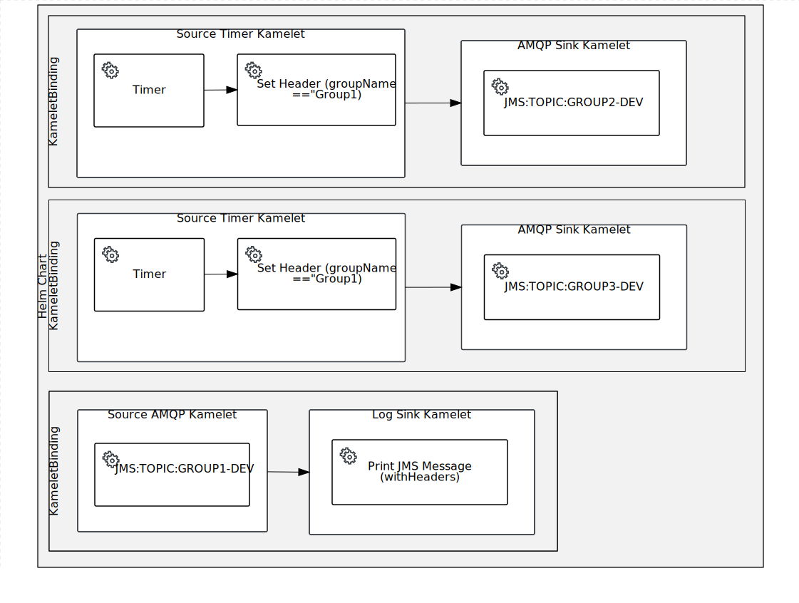

# Lab 3 - KameletBinding evolution

## Intro

So far we have been developing our integrations in Java. There are other DSL out there (such as groovy, javascript, and even yaml) but development of such Integrations is still a fairly technical task and it requires camel knowledge. However with well designed (reusable, configurable) `Kamelets` it's possible to deploy an integration using a slightly different way - by utilizing `KameletBinding`. 

As the name suggests, it's a OpenShift custom resource which allows you to bind source/sink kamelets (or camel components) in a declarative way. This opens new possibilities for camel-k. __KameletBindings__ enable non-camel experts to deploy and configure Integrations. 

This doesn't mean usage of camel-k doesn't require deep technical and integration knowledge - somebody _still_ has to develop and maintain the Kamelets, but once that is done, the adoption of __KameletBindings__ (especially when combined with a templating engine such as `helm`) will be very straightfoward. 

It has another advantage - the fact it's a OpenShift CR means we don't have to deal with `kamel cli` anymore to run an integration. We can directly apply the file on OpenShift and it will result into running Integration. This also greatly fits into today's GitOps ways of working.

<br/>

## Task

In this lab we will:
- Turn our Java based integration into a Kamelet Binding. 
- Use `helm` to generate multiple Kamelet Bindings with ease. 
- Generate N bindings (where N is number of groups-1) to generate messages for every group in this lab. 
- Add one more binding which will simply read all the messages you as a group received. 

<br/>

The output of the helm chart should produce this:



`The actual helm templates were already developed for you.`

<br/>

While helm and KameletBindings go really well together - because it's really easy to template the bindings, Kamelets also heavily depend on using `{{ camel-k-placeholders }}` which conflicts with `{{ helm-placeholders }}`, so figuring out the syntax is a major PITA.

<br/>

__1. Create Secrets__

- Let's start by secret provisioning. If you finished previous lab, you should already have secret containing `client.ts` available in `userN-dev` namespace. If not, make sure to create it now, i.e.: 

  ```
  $ cd lab3/utils

  $ oc create secret generic my-artemis-secret --from-file=client.ts
  ```

<br/>

- Add one more secret - previously, our Java integration contained some hardcoded values with sensitive information (such as broker credentials). This is of course not feasible in beyond demo scenario! Let's create _another_ secret which will contain:

  - broker username (admin)
  - broker password (password1!)
  - broker connection url (amqps://rhte-artemis-one-way-ssl-0-svc.tooling.svc.cluster.local:5673)
  - truststore password (password1!)

  __You can use `utils/create-secrets.sh` and `utils/artemis-secret.yaml` to assist with this task.__

  ```
  ## Change the values in create-secrets.sh
  $ ./create-secrets.sh
  ```

<br/>

__2. Helm + Kamel = 💪__

- Explore `charts/templates` - that's where all the magic happens. We are defining a few custom Kamelets, but most importantly we are templating the creation of Kamelet Bindings. 
  - Understand how _binary_ (vs "normal") secrets are handled. 
  - We are also using [traits](https://camel.apache.org/camel-k/1.8.x/traits/traits.html) which is a camel-k feature which allows us to enable additional super powers on top of our integrations. Usage of the `Container` trait is almost inevitable in OCP environment. 
  - If you study `kamelet-bindings.yaml` you will notice it is completely generic and supports _any_ two Kamelets and _any_ properties.

  <br/>

  This is a very powerful concept as you can use this as a base template to define integrations for many different systems. However, if this was a real-world scenario, this helm chart wouldn't be so useful without the accompanying documentation. The only way how to make the consumption of such helm chart easy, is to make sure its consumers can focus on just supplying helm values, and not to deal with the underlying templates (which are still fairly complex and technical).

  <br/>


- Change `dev/values.yaml` in such a way that will create the appropriate bindings as per the Helm Diagram screenshot. There are scripts ready for you in `utils` to test the helm chart. 

  ```
  $ oc project userN-dev
  $ ./install.sh
  ```

  The result should look similar to this:


  ```
  $ oc get klb -n userN-dev
  NAME                           PHASE   REPLICAS
  rhte-camelk.group1.to.group2   Ready   1
  rhte-camelk.group1.to.group3   Ready   1
  rhte-camelk.group1.to.group4   Ready   1
  rhte-camelk.group1.to.group5   Ready   1
  rhte-camelk.group1.to.group6   Ready   1
  rhte-camelk.group1.to.group7   Ready   1
  rhte-camelk.group1.to.log      Ready   1
  ```

  The number of "groupN.to.groupM" bindings can differ based on the number of actual groups present in the lab. Don't forget to check the integration logs to make sure there are no errors. You can use `kamel get` and `kamel log`, or plain `oc`. 

<br/>

## Summary
We showcased how `helm` can be easily used to generate KameletBindings. This combination allow easier consumption of camel-k styled integration, as all it requires is a documentation of `helm` value files.  We also showed how to inject configuration and sensitive data into the bindings and also scratched the surface on the `traits`.