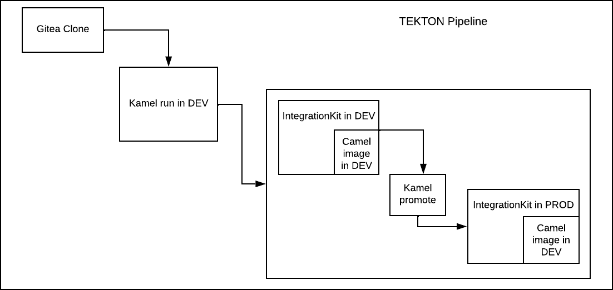

# Lab 4 - Traditional CI/CD

## Intro
There are multiple challenges when it comes to CI/CD of the camel-k based projects. 

You will likely find out at your customers that their traditional CI/CD implementations will not be suitable to build, test and promote the camel-k integration. 

Another challenge is less subtle and will only surface when you start looking under the hood of the integration lifecycle:

__How do you ensure that the camel-k integration in dev and prod will be based on the _same_ container image?__ 

This has been historically very hard to achieve and it changed only recently with the arrival of the `kamel promote` feature which we are going to explore in Lab 4.

<br/>

## Tasks

__1. Investigate immutability principles__

We'll start by inspecting the immutability principles which are by default violated when using `kamel run`. 

 - Delete IntegrationKit from `userN-dev` and `userN-prod`. 
    ```
    $ kamel reset --namespace <MY_NAMESPACE>     (deletes everything)
    
    or 

    $ oc delete ik 
    ```

 - Start the example Integration which is provided in the lab directory in dev namespace:
   ```
   $ cd lab4

   $ kamel run MutableIntegration.java --namespace userN-dev

   You should see a similar result to:
   Unable to verify existence of operator id [camel-k] due to lack of user privileges
   Integration "mutable-integration" created
   ```

 - Find out what IntegrationKit is your integration using and note down the name of the container image
    ```
    $ oc get it mutable-integration

    $ oc get ik <INTEGRATION_KIT_NAME_FROM_PREVIOUS_STEP>
    ```

 - Manually deploy the integration into the production namespace and repeat the procedure.
    ```
    $ kamel run MutableIntegration.java --namespace userN-prod
    ```

 - Are the container images in __dev__ and __prod__ the __same or not?__

<br/>

Let's examine what happened:

We are running two separate `Namespace-scoped` installations of camel-k operator, which are completely independent. 

By default, there is no way for the camel-k operator to know it should re-use the existing `IntegrationKit` (or its container image), so it will initiate a completely new build, thus violating immutability principles. 

If you'd be running a global operator installation, this _could_ potentially work - but if you delete the IntegrationKit in between the integration promotion you would arrive at the same outcome. And the same outcome would happen if you'd be doing integration promotion across clusters.

<br/>

__2. Fix immutability__


Now let's see how we can use `kamel promote` to overcome this problem. 

Most of the resources are already provided for you, you just need to fill in the blanks. 

We have prepared a `Tekton pipeline` for you which:
- fetches the gitea repo
- runs the camel-k integration
- promotes it to production by utilizing `kamel promote`

<br/>



<br/>

`In a real world pipeline there would be some integration and smoke tests as well, but this is beyond the scope of this lab.`

<br/>


Complete Lab4:
  - Examine `create-resources.sh` script, `change it as needed` and `run it`
      ```
      $ ./create-resources.sh
      ```
      
      This will create all the resources necessary for the Integration. Note that we _must_ precreate these in advance of running `kamel promote` operation in the target (production) namespace as well. In a real scenario these would be populated by the pipeline or via GitOps. 
  - Inspect `pipeline.yaml` and understand what it does.
      - Fix the parameters of `kamel run task` (line 331-337). 
         
         You need to config and mount all the required secrets and config maps. 
         
         Refer to [Runtime Configuration](https://camel.apache.org/camel-k/1.10.x/configuration/runtime-config.html) and [Runtime Resources](https://camel.apache.org/camel-k/1.10.x/configuration/runtime-resources.html) if you need help.
      - Fix parameters of `kamel promote task` (line 346-352)
  - Inspect `pipeline-run.yaml` and fix the git repo url at line 28
  - Apply `pipeline.yaml` and `pipeline-run.yaml` onto your OCP cluster. You can inspect the Tekton pipelines also via OpenShift console
      ```
      $ oc apply -f pipeline.yaml -n userN-dev

      $ oc apply -f pipeline-run.yaml -n userN-dev
      ```
  - Troubleshoot any potential issues and verify whether the container images are the same for both, dev and prod integration

<br/>

## Summary

`kamel promote` simplifies the promotion of the camel-k integrations to higher environments. 

It ensures immutability principles by reusing the same container images between different environments. It also simplifies the configuration - it's smart enough to understand what configuration (config maps, secrets) were part of the source integration so we don't have to explicitly state it anymore when promoting to higher environment. 

What it lacks is the better integration with GitOps styled deployments. The [issue](https://github.com/apache/camel-k/issues/3888) has been raised to improve this behaviour.