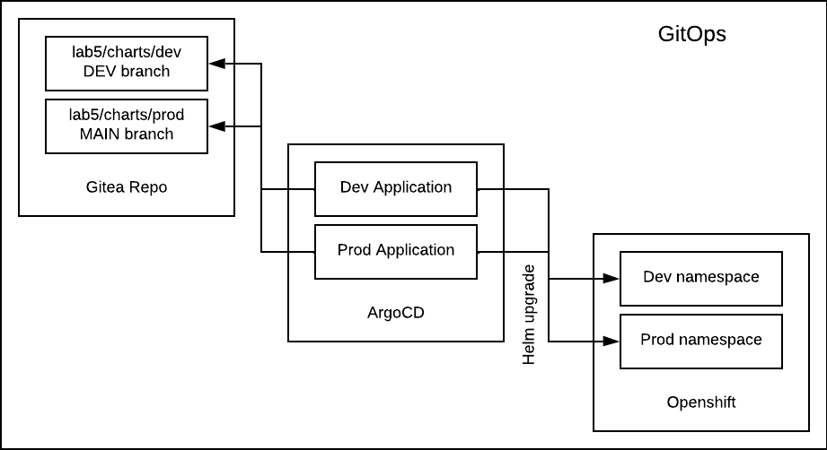

# Lab 5 - GitOps styled Continuous Delivery

## Intro

In this lab we are going to deploy our Integrations using GitOps approach. 

We will explore helm and ArgoCD integration, sealed secrets and also promotion process between `dev` and `prod` environment.

<br/>



<br/>

## Tasks

__1. Create SealedSecrets__

-  Checkout `main` branch of your user gitea repository and switch context to `userN-dev` openshift project.
-  Cleanup leftovers from the previous lab - edit `cleanup.sh` and execute it
    ```
    $ cd labs/lab5
    $ ./utils/cleanup.sh
    ```
-  Generate Sealed secrets through a prepared script.
    ```
    $ ./utils/create-secrets.sh
    ```
- Move the generated yaml files to `labs/lab5/secrets/dev` folder.
- Change context to `userN-prod` openshift project and execute the same script again. This time, move the generated files to `labs/lab5/secrets/prod`.
- Make sure to delete any generated yaml files from the `utils` folder. 
- Commit and push your changes.

The `create-secrets.sh` script is using `kubeseal` cli to communicate with the SealedSecret controller in order to seal your secrets. The generated secrets are encrypted and can be safely stored to the git repository since they can't be decrypted without the private key, which is owned by the SealedSecrets controller. 

Each user has 4 different Argo applications created for them, you can find more about these:
```
$ oc get application -n openshift-gitops | grep userN-
```

Once you push the sealed secrets to your git repository, ArgoCD will apply them to the desired namespace and the SealedSecret controller will turn the SealedSecret into regular openshift secrets, which can be finally used by our camel-k integrations.

-  Verify everything went well:
 ```bash
 $ oc get sealedsecret
 $ oc get secret <NAME OF THE SECRET>
 ```

<br/>

__2. Create Camel-K objects__

- Checkout the `dev` branch and edit `lab5/charts/dev/values.yaml` - Add as many bindings as needed, and don't forget to adjust names and destinationNames so they match your group name. 
- Git commit and push your changes to the `dev` branch. The ArgoCD application is monitoring `dev` branch for changes and will apply them to `userN-dev` openshift project`
-  Verify your changes by looking for a new pods in `userN-dev` namespace.
-  When you are happy with the behavior of your integrations in the dev namespace, create a new branch based on dev
    ```
    $ git checkout -b feature/my-first-prod-release origin/dev
    ```
- Modify `lab5/charts/prod/values.yaml` only. Copy bindings from `dev` environment but change destination name and userNamespace to point to `prod` namespace. 
- Commit and push your changes
- Create a pull request from `feature/my-first-prod-release` to `main` branch. Review and approve the pull request.
- Verify that the bindings are correctly created in `userN-prod` namespace - which is the namespace used by Argo application monitoring the `main` branch.

## Summary

In this chapter we showed how can we use Helm and ArgoCD to effectively deploy and promote our integration. 

When using `camel-k`, the CRs used (Integrations, Kamelet Bindings) fully represent the integration. There is no need for any intermediate steps in form of compiling or building the integration. KameletBinding _is_ your integration. 

Obviously, for more advanced use cases you'd want to combine the approach from Lab 4 (CI) with the one in Lab5 (CD) to include testing and automated promotion.